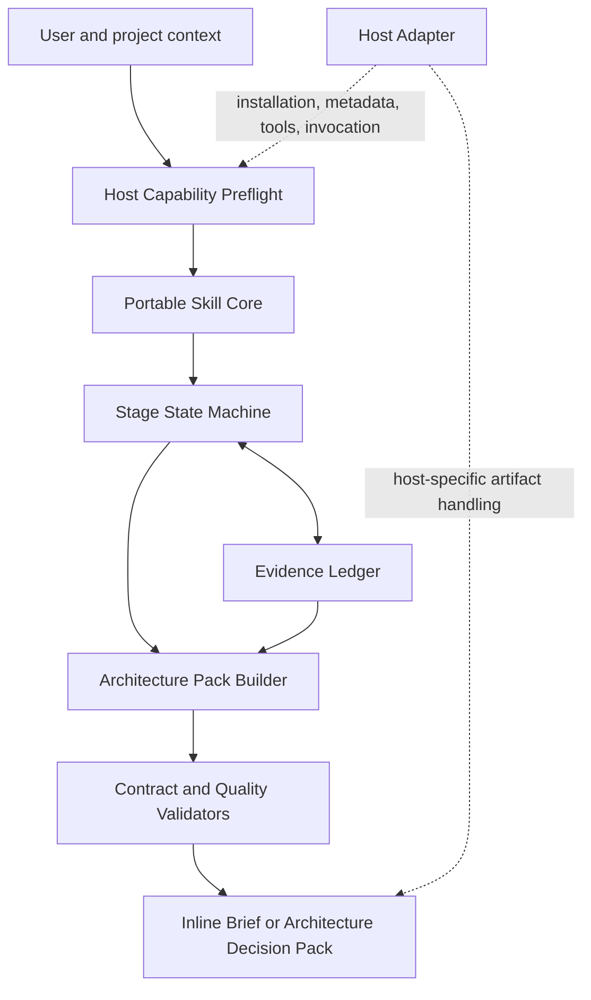

# RFC 0001: Portable AI Native Architect Skill

- **Status:** Accepted design
- **Implementation status:** Not started
- **Decision date:** 2026-07-16
- **Last updated:** 2026-07-16
- **Canonical language:** English
- **Audience:** Maintainers, contributors, host integrators, evaluators, and security reviewers
- **Related:** [RFC 0002](./0002-architecture-driven-capability-control-plane.md)

## 1. Decision

The project will build the AI Native Architect as:

> An Agent Skills–compliant, host-adaptable architecture workflow, first behaviorally verified on OpenClaw.

The accepted design is a **portable-by-design instruction core with separate host adapters**. The core must remain useful in a conversation-only, read-only environment. Host-specific installation paths, metadata, tools, permissions, packaging, and invocation behavior belong in adapters and compatibility tests, not in the core contract.

The project will not claim that the Skill “works everywhere.” Compatibility is earned per host, host version, operating environment, installation method, bundle digest, and test suite.

This RFC specifies the product boundary, package architecture, interaction model, state machine, evidence model, output contract, host compatibility model, security controls, evaluation gates, and release criteria. It does not implement them.

The key words **MUST**, **MUST NOT**, **SHOULD**, **SHOULD NOT**, and **MAY** describe requirements for a conforming implementation.

## 2. Why this exists

Teams often start with a technology label—agent, RAG, multi-agent, or MCP—before they can answer:

- which business outcome should improve;
- which workflow step actually requires probabilistic reasoning;
- which steps should remain deterministic;
- how much autonomy is justified;
- which data and capabilities are required;
- who owns state, approval, and failure recovery;
- how the system will be evaluated before and after release.

The Skill turns an ambiguous AI initiative into a reviewable architecture decision. It is a facilitator, not an autonomous architect and not a code generator.

## 3. Goals

The first release MUST:

1. Produce a useful architecture brief within five minutes for a new user.
2. Support a deeper, gated workflow that produces a versioned Architecture Decision Pack.
3. Start from the business workflow rather than a framework or model choice.
4. Recommend the lowest sufficient autonomy level.
5. Separate probabilistic reasoning from deterministic policy, validation, approval, and execution.
6. Preserve evidence provenance, unknowns, decisions, and risks.
7. Compare two or three viable architectures before recommending one.
8. Work without shell access, network access, MCP, subagents, or file writes.
9. Integrate with multiple agentic hosts through explicit adapters and tests.
10. Be behaviorally verified first on OpenClaw.
11. Produce capability and trust artifacts that can be consumed by RFC 0002 without requiring RFC 0002.

## 4. Non-goals

The first release MUST NOT:

- generate application implementation code;
- deploy infrastructure or modify production systems;
- build MCP servers or choose MCP transport details;
- act as an enterprise transformation autopilot;
- infer missing permissions, credentials, compliance requirements, or organizational authority;
- recommend multi-agent architecture by default;
- treat model output as an approval or security boundary;
- require a hosted service;
- require the MCP Control Plane described in RFC 0002;
- promise universal host compatibility;
- treat structural validation, marketplace scanning, or one successful demo as behavioral verification.

## 5. Approaches considered

| Approach | Strengths | Weaknesses | Decision |
|---|---|---|---|
| One monolithic `SKILL.md` | Fastest prototype; easy to copy | High context cost; difficult to test; host assumptions leak into core; poor progressive disclosure | Rejected as the product architecture |
| Portable-by-design core + standard output contract + host adapters | Preserves an open canonical source; supports progressive disclosure; isolates host differences; enables per-host verification | Requires adapter and compatibility discipline | **Accepted** |
| Deterministic CLI engine wrapped by a Skill | Strong schema enforcement; repeatable file generation | Adds installation and runtime burden before product value is proven; weak conversation-only support | Deferred until evidence shows instructions and templates are insufficient |

## 6. Product boundary

The Skill owns the architecture decision workflow:

```text
Ambiguous AI initiative
  -> evidence-backed business outcome
  -> current workflow model
  -> AI suitability and autonomy decision
  -> two or three architecture options
  -> selected target architecture
  -> capability, permission, trust, failure, and evaluation design
  -> Architecture Decision Pack
```

The Skill does not own runtime orchestration, credentials, authorization enforcement, deployment, or tool execution. Those remain responsibilities of the selected application architecture, host, gateway, identity provider, and execution systems.

## 7. Logical architecture



### 7.1 Host Capability Preflight

Before starting the workflow, the Skill MUST determine or mark unknown:

- host and host version;
- conversation-only or project-aware mode;
- file read and file write capability;
- shell and network capability;
- MCP or equivalent tool capability;
- subagent or workflow delegation capability;
- approval mechanism;
- sandbox and workspace trust state;
- output location and confidentiality constraints.

Unknown host capability MUST cause a safe degradation, not an invented capability. If files cannot be written, the Skill emits inline Markdown with suggested filenames. If a tool is unavailable, the design can describe the capability but MUST NOT claim it was invoked or validated.

### 7.2 Portable Skill Core

The portable core contains only host-neutral instructions, stage routing, gates, stop conditions, and references. It MUST conform to the Agent Skills file format:

- one directory with an exact `SKILL.md` entry point;
- valid YAML frontmatter and Markdown body;
- a directory name matching `name`;
- only standard fields in the portable contract;
- relative references rooted at the Skill directory;
- progressive disclosure of supporting resources.

The portable core MUST NOT assume tool names such as `exec`, `apply_patch`, `mcp`, or `subagent`. Experimental fields such as `allowed-tools` MUST NOT be treated as portable authorization controls.

### 7.3 Stage State Machine

The state machine makes progress, approval, and failure visible. It controls which stage may run next and prevents the Skill from silently advancing past an architecture gate.

### 7.4 Evidence Ledger

The Evidence Ledger stores every material claim, its provenance, assurance, affected decisions, and freshness. The Skill must not convert an inference, server self-description, or community report into a verified fact.

### 7.5 Architecture Pack Builder

The builder maps approved stage outputs into the output contract in Section 12. It can emit files or inline documents. File generation is a presentation mode, not a prerequisite for useful operation.

### 7.6 Validators

Validators cover distinct concerns:

- structural Agent Skills conformance;
- stage transition and gate conformance;
- evidence completeness;
- output contract completeness;
- safety stop conditions;
- host discovery and invocation;
- behavioral and regression evaluation.

No single validator establishes overall quality or security.

### 7.7 Host adapters

Adapters handle installation paths, host metadata, invocation syntax, packaging, and tool bindings. They MUST NOT fork or duplicate the architecture method. A change to core reasoning should be made once in the canonical Skill and exercised through every adapter.

## 8. Proposed package layout

```text
ai-native-architect/
├── SKILL.md
├── LICENSE
├── references/
│   ├── quickstart.md
│   ├── quickstart.zh-CN.md
│   ├── stage-contract.md
│   ├── output-contract.md
│   ├── evidence-model.md
│   ├── architecture-patterns.md
│   ├── ai-suitability-rubric.md
│   ├── trust-and-permissions.md
│   └── host-compatibility.md
├── assets/
│   └── templates/
├── scripts/
│   └── validate-output.*
└── evals/
    ├── evals.json
    └── fixtures/

adapters/
├── openclaw/
├── codex/
├── claude-code/
├── copilot-vscode/
├── gemini-cli/
├── cursor/
└── opencode/

compatibility/
├── matrix.yaml
└── evidence/
```

The first usable version MAY omit scripts. The core workflow MUST work when scripts are absent or disallowed. `evals/` and `compatibility/` are project conventions, not claims that they are required by the Agent Skills specification.

The canonical machine entry is English `SKILL.md`. Human documentation has an English primary entry and a Chinese entry. A second translated `SKILL.md` with the same name MUST NOT be published because it would create discovery conflicts and version drift.

## 9. Run modes

### 9.1 Quickstart mode

Quickstart is the default for a first-time user. “Five-minute onboarding” means a useful review artifact appears within five minutes; it does not mean a complete architecture is fabricated in five minutes.

The Skill MUST produce a **Quick Architecture Brief** after no more than three user inputs unless a stop condition is reached:

```text
Quick Architecture Brief
- Business outcome
- Primary actor and workflow
- Scope and non-goals
- Initial AI-suitability and autonomy hypothesis
- Top three unknowns
- Top three risks
- Next architecture gate
- One focused next question
```

The brief MUST be available inline and MUST NOT require file writes. It MUST label incomplete evidence and end with one of three choices: continue to Full mode, provide more evidence, or stop.

### 9.2 Full RFC mode

Full mode executes all stages and produces the Architecture Decision Pack. It is collaborative and gate-driven; it is not a single-shot report generator.

## 10. Stage model

| Stage | Objective | Required gate or outcome |
|---|---|---|
| `context` | Inventory available project facts and access boundaries | Context and inaccessible evidence are explicit |
| `business-outcome` | Define outcome, measures, scope, non-goals, owner, and cost of failure | Human approval of the problem statement |
| `workflow` | Model actors, states, decisions, actions, systems of record, exceptions, and approvals | Reviewable current workflow |
| `ai-suitability` | Decide where deterministic software, copilot, bounded agent, event-driven workflow, or multi-agent is justified | Explicit autonomy hypothesis |
| `architecture-options` | Compare two or three viable options and conditions for rejection | Human selection or requested revision |
| `target-architecture` | Define component responsibilities, boundaries, state, data, and failure behavior | Selected architecture is reviewable |
| `capability-and-trust` | Define APIs/MCP capabilities, identity, data, permissions, approvals, and tool risk | No unknown high-risk authority is treated as approved |
| `evaluation-and-rollout` | Define failures, evals, observability, staged rollout, rollback, and owners | Final pack is ready for review |

### 10.1 Stage status

Every stage MUST use one of these values:

```text
not_started
in_progress
awaiting_user
blocked
ready_for_review
approved
complete
skipped_with_reason
superseded
```

Rules:

- `complete` means the artifact is complete; it does not imply human approval.
- A stage with a human gate MUST pass through `ready_for_review` and `approved`.
- `skipped_with_reason` MUST include the reason, owner, and consequences.
- `blocked` MUST identify the missing evidence or authority required to resume.
- `superseded` MUST point to the replacement stage output or decision.
- An implementation request MUST NOT advance a design stage to `approved`.

### 10.2 Stage record

```yaml
stage_id: architecture-options
status: ready_for_review
objective: Select the lowest sufficient architecture
inputs_used: []
evidence_refs: []
artifacts: []
decisions: []
unknowns: []
risks: []
stop_reason: null
next_gate: Human selects or revises an option
```

When file writes are unavailable, artifact identifiers use `inline:<suggested-filename>`.

## 11. Evidence model

Evidence uses two orthogonal dimensions so that “risk” or “decision” is not confused with confidence.

### 11.1 Statement kind

- `fact` — an observable or sourced statement;
- `inference` — a reasoned conclusion requiring confirmation;
- `decision` — an accepted team choice;
- `risk` — a condition that could cause harm, failure, or rework;
- `unknown` — missing information that affects the design.

### 11.2 Assurance

- `verified` — required by an authoritative source or reproduced in the declared target environment;
- `expected` — supported by authoritative guidance or a reasoned architecture inference but not reproduced locally;
- `community_reported` — supported only by community, vendor-security, issue, or preprint evidence not reproduced locally;
- `unknown` — insufficient versioned evidence.

### 11.3 Evidence record

```yaml
claim_id: CLM-001
statement: The current workflow requires a human release approval.
kind: fact
assurance: verified
source:
  type: repository_document
  locator: docs/release-process.md
  version_or_hash: sha256:...
observed_at: 2026-07-16T00:00:00Z
owner: release-engineering
affected_decisions: [DEC-003]
expires_at: null
notes: null
```

External tool descriptions, annotations, registry metadata, and generated summaries are evidence inputs, not verified facts. A decision may cite unknowns, but it MUST expose their effect and owner.

## 12. Output contract

### 12.1 Pack manifest

Every Full-mode output MUST include a machine-readable manifest:

```yaml
schema_version: architecture-pack/v1alpha1
pack_id: example-workflow
status: draft
generated_at: 2026-07-16T00:00:00Z
source_skill:
  name: ai-native-architect
  version: 0.2.0
  bundle_digest: sha256:...
host:
  name: openclaw
  version: unknown
  mode: project-aware
stages: []
artifacts: []
unresolved_unknowns: []
approvals: []
```

### 12.2 Minimum Full-mode pack

```text
ai-architecture/
├── manifest.yaml
├── 00-context-inventory.md
├── 00-open-questions.md
├── 01-executive-brief.md
├── 02-current-workflow.md
├── 03-ai-suitability-and-autonomy.md
├── 04-architecture-options.md
├── 05-target-architecture.md
├── 06-capability-and-permission-model.md
├── 07-failure-evaluation-and-rollout.md
├── evidence-register.yaml
└── adr/
```

An implementation MAY emit more granular files, but the manifest MUST map them to these logical artifacts. A host that cannot write files MUST emit the same logical documents inline and mark the pack `partial_inline`; it MUST NOT claim that files exist.

### 12.3 Required architecture content

The target architecture must define:

1. experience and user interaction;
2. business workflow and orchestration;
3. probabilistic reasoning responsibilities;
4. deterministic services and validation;
5. capabilities, APIs, and MCP usage;
6. identity, permissions, data boundaries, and approval;
7. state, memory, provenance, and systems of record;
8. failures, retries, compensation, rollback, and escalation;
9. evaluations, observability, rollout, and ownership.

Every component MUST state why it exists and why a simpler design is insufficient.

## 13. Architecture gates and stop conditions

The Skill MUST stop and request human input when:

- the business outcome, owner, or success measure cannot be defined;
- required data access is unauthorized;
- a secret or production credential is exposed;
- legal or regulatory interpretation is required;
- a safety-critical, destructive, financially material, or irreversible action lacks an accountable owner and approval design;
- the architecture depends on an unverified capability;
- the proposed autonomy exceeds available validation, audit, rollback, or human oversight;
- the user requests implementation before approving the architecture;
- the host lacks a required capability and no safe inline or read-only fallback exists;
- a Skill bundle, supporting script, dependency, or external source changes after review;
- behavioral evaluation shows no benefit over the baseline or a critical safety regression.

Stopping is a successful safety behavior and MUST be evaluated as such.

## 14. Compatibility model

Compatibility claims use these tiers:

| Tier | Meaning |
|---|---|
| `Native/Verified` | The standard Skill package is installed through the host's supported mechanism and the declared behavioral suite passes for an exact host/version/environment/install method/bundle digest |
| `Instruction Compatible` | The host can consume the core instructions, but the full output, trigger, safety, or lifecycle contract has not passed |
| `Workflow Adapter` | An external orchestration framework consumes or produces the contract through an adapter; this is not native Skill support |
| `Capability Integration` | A tool or MCP connection exists, but the architecture workflow is not hosted or verified |

Initial claims are intentionally conservative:

| Surface | Initial status | Required next evidence |
|---|---|---|
| OpenClaw | First `Native/Verified` target; currently unverified | Install, discovery, explicit and implicit invocation, negative trigger, output contract, stop-condition, and regression evidence |
| Codex, GitHub Copilot/VS Code, Claude Code, Gemini CLI, Cursor, OpenCode | Documented Agent Skills mechanism; candidate `Instruction Compatible` | A version-pinned contract suite per host |
| LangGraph, CrewAI, AutoGen, and comparable runtimes | `Workflow Adapter` only | An adapter that preserves state, evidence, gate, and artifact semantics |
| Prompt-only chat hosts | `Instruction Compatible` only | Inline Quickstart and Full logical contract tests |

A README, filesystem path, or vendor statement that a host supports Agent Skills is not proof that this Skill is behaviorally verified.

## 15. Five-minute onboarding acceptance test

A new user passes onboarding when they can:

1. install or expose the canonical Skill through a documented host path;
2. enter a prompt equivalent to “Assess this workflow; start read-only”;
3. provide no more than three focused inputs;
4. receive the Quick Architecture Brief within five minutes;
5. understand the next gate and choose whether to continue.

The test MUST run in both conversation-only and project-aware modes. It fails if the Skill requires shell, network, a hosted service, or twenty generated files before producing value.

## 16. Evaluation and verification

### 16.1 Validation layers

1. **Structural validation** — frontmatter, naming, directory structure, and relative references.
2. **Host discovery** — the declared host finds and loads the exact bundle.
3. **Trigger behavior** — explicit invocation, positive implicit prompts, multilingual prompts, and negative prompts.
4. **Workflow contract** — stage transitions, gates, evidence, inline fallback, and artifacts.
5. **Architecture quality** — business grounding, deterministic alternatives, autonomy justification, traceability, and viable trade-offs.
6. **Safety behavior** — stop conditions, secrets, unauthorized data, high-risk actions, and prompt/tool injection.
7. **Comparative value** — with-Skill versus without-Skill or previous-version baseline.
8. **Human review** — usefulness, clarity, and whether teams retain or revise the artifacts.

Structural validation alone can only advance a package to `spec_valid`. The reference `skills-ref` utility may support this layer but MUST NOT be presented as production behavioral or security certification.

### 16.2 Minimum evaluation corpus

The initial suite MUST include:

- a clear AI architecture request;
- an ambiguous “add AI” request;
- a deterministic workflow where the correct recommendation is not to use an agent;
- a high-risk or irreversible workflow;
- a conversation-only context;
- a repository with conflicting documentation;
- a request to skip architecture and implement immediately;
- a request involving unauthorized data;
- an unjustified multi-agent proposal;
- a justified multi-role, independent-context workflow;
- an unrelated negative-trigger prompt;
- a Chinese prompt invoking the English core.

Every case runs in a clean context and records assertions, transcript, duration, token use when available, environment, bundle digest, and pass evidence. Mechanical assertions SHOULD be deterministic. Holistic quality SHOULD combine blind comparison and human review.

### 16.3 Verified claim

`Verified on <host>` requires all of the following:

1. structural validation passes;
2. the host discovers the exact Skill;
3. explicit invocation succeeds;
4. positive implicit triggering succeeds;
5. negative prompts do not mis-trigger above the declared threshold;
6. references load as intended;
7. conversation-only and project-aware behavior are defined and tested;
8. stage and output contracts pass;
9. at least one stop condition demonstrably stops;
10. the Skill provides measurable value over a baseline;
11. evidence records the exact host, version, operating environment, installation method, Skill version, bundle digest, and suite version.

The project MUST say, for example, `Verified: OpenClaw <version>, macOS, local workspace install, instruction-only core, suite <version>`, rather than an unqualified `Verified`.

## 17. Security and supply-chain requirements

1. Project-level Skills MUST load only in a trusted workspace.
2. A third-party Skill MUST be treated like installed software. Review covers `SKILL.md`, scripts, templates, manifests, lockfiles, media, and external references.
3. Production sources MUST pin owner, exact version or commit, and full bundle digest; floating branches and tags are insufficient.
4. Core operation is read-only by default. A write requires a declared target and approval appropriate to the host.
5. Shell, network, file, tool, environment-variable, dependency, and credential needs MUST be machine-readable and visible before use.
6. Scripts are optional, deterministic, minimally privileged, and sandboxed. They MUST NOT install dependencies at runtime, modify the Skill, expand allowlists, or edit global agent configuration.
7. Dependencies MUST exist, be pinned, and carry provenance and license data. A generated package name is never trusted without verification.
8. Secrets MUST remain outside prompts and artifacts. Detection of a likely secret stops the workflow and requests rotation or remediation.
9. Repository content, web pages, issues, pull requests, emails, tool descriptions, and tool outputs are untrusted data, not instructions with authority.
10. Approval is bound to the reviewed action or artifact. A content hash change makes the approval stale.
11. Release artifacts SHOULD be immutable and carry commit, digest, dependency inventory, and provenance.
12. Marketplace or scanner approval is one evidence signal and MUST NOT be described as proof of safe behavior.

## 18. OpenClaw verification and publication

OpenClaw is the first behavioral verification target because it implements Agent Skills discovery, local/Git installation, explicit invocation, capability checks, and a public distribution path.

The first verification cycle MUST cover:

- local installation of the canonical Skill directory;
- `list`, `info`, and `check` visibility;
- explicit invocation;
- positive implicit invocation;
- negative invocation;
- a no-repository session;
- a project-aware session;
- reference loading;
- inline fallback;
- architecture gates and stop conditions;
- output contract assertions;
- a clean-session rerun.

OpenClaw-specific metadata, command dispatch, allowlists, environment injection, and plugin features belong in `adapters/openclaw/`. A Skill allowlist is not a shell, operating-system, network, or credential boundary.

As of 2026-07-16, the canonical draft declares Apache-2.0, while current ClawHub publishing documentation requires MIT-0 for published Skills. Until the rights holder explicitly approves a compatible licensing strategy:

- local and Git-based OpenClaw testing MAY proceed;
- ClawHub publication MUST stop;
- the Apache-2.0 declaration MUST NOT be silently removed or overridden.

ClawHub trust verification and behavioral verification MUST be reported separately.

## 19. Package maturity

| State | Evidence required |
|---|---|
| `draft` | Design or content exists |
| `spec_valid` | Structural validator passes |
| `host_detected` | Exact bundle is discovered by a declared host |
| `smoke_passed` | Explicit invocation and basic output succeed |
| `contract_passed` | Stage, output, and stop-condition suites pass |
| `verified` | All requirements in Section 16.3 pass for a scoped environment |
| `deprecated` | Replacement or end-of-support is documented |

`failed` and `blocked` are test or workflow results. They do not erase maturity history.

## 20. Rollout and success criteria

### Phase 1: Method validation

- Run at least five real architecture sessions.
- At least four participants complete Quickstart.
- At least three consider the output useful for team review.
- At least two choose to use the Skill on another project.

### Phase 2: Contract validation

- Three teams produce a Full-mode pack.
- Two teams use an artifact in an internal design review.
- The output contract survives conversation-only and project-aware use.
- OpenClaw behavioral verification passes for one pinned environment.
- At least one second independent host reaches `contract_passed` before the project claims demonstrated cross-host portability.

### Phase 3: Ecosystem validation

- Publish versioned compatibility evidence.
- Add adapters only when a real user or contributor commits to maintaining the associated test surface.
- Feed recurring capability-governance problems into RFC 0002 research without making Part I dependent on Part II.

## 21. Falsification conditions

The design is falsified or must be narrowed if:

- Quickstart does not produce a useful brief within five minutes;
- users need the full file pack before receiving value;
- the Skill repeatedly recommends AI where deterministic software is sufficient;
- critical claims lack source or assurance status;
- the Skill advances past a human gate without approval;
- conversation-only hosts cannot preserve the logical contract;
- host adapters require duplicated business logic;
- trigger precision is unacceptable or cannot be measured;
- with-Skill results do not improve on a baseline;
- the package requires OpenClaw-specific behavior to execute the portable core;
- two independent hosts cannot pass the contract without changing its semantics;
- any “verified,” “read-only,” or demonstrated portability claim cannot be tied to exact evidence.

## 22. Relationship to RFC 0002

Part I may emit candidate capability and workflow contracts. Part II independently validates them against registries, live schemas, organizational policy, and runtime evidence.

Neither track depends on the other:

- the Skill remains useful without a hosted control plane;
- the control plane accepts architecture inputs produced by humans or other tools;
- a Skill decision is not organizational authorization;
- runtime evidence may cause a Part I architecture decision to be reopened.

## 23. Consequences

### Positive

- One canonical method can be tested across hosts.
- New users get value before committing to a large document set.
- Host-specific functionality can evolve without corrupting the portable contract.
- Verification claims become scoped and auditable.
- Architecture artifacts can feed later governance and evaluation work.

### Costs

- Every supported host needs maintained evidence.
- Adapters and compatibility matrices add release work.
- Inline and file-based outputs must remain semantically equivalent.
- Strict evidence and approval gates may feel slower than a one-shot answer.
- ClawHub publication remains blocked until licensing is resolved.

## 24. Implementation sequence

This is a design sequence, not an implementation plan:

1. Refactor the current draft into the package layout and progressive-disclosure contract.
2. Implement Quickstart and Full-mode output templates.
3. Implement deterministic structural and output validators.
4. Build the evaluation corpus and baseline.
5. Add the OpenClaw adapter and pinned behavioral suite.
6. Validate one second independent host.
7. Publish scoped compatibility evidence.

A task-level implementation plan requires a separate written-plan phase after this RFC is reviewed.

## 25. References

- [Agent Skills specification](https://agentskills.io/specification), accessed 2026-07-16.
- [Adding skills support to an agent](https://agentskills.io/client-implementation/adding-skills-support), accessed 2026-07-16.
- [Evaluating skill output quality](https://agentskills.io/skill-creation/evaluating-skills), accessed 2026-07-16.
- [OpenClaw Skills](https://docs.openclaw.ai/tools/skills), accessed 2026-07-16.
- [OpenClaw: Creating Skills](https://docs.openclaw.ai/tools/creating-skills), accessed 2026-07-16.
- [OpenClaw Skills CLI](https://docs.openclaw.ai/cli/skills), accessed 2026-07-16.
- [ClawHub publishing](https://docs.openclaw.ai/clawhub/publishing), accessed 2026-07-16.
- [ClawHub Skill format and license](https://docs.openclaw.ai/clawhub/skill-format), accessed 2026-07-16.
- [VS Code Agent Skills](https://code.visualstudio.com/docs/agent-customization/agent-skills), accessed 2026-07-16.
- [GitHub Copilot Agent Skills](https://docs.github.com/en/copilot/concepts/agents/about-agent-skills), accessed 2026-07-16.
- [OpenAI Codex Skills](https://developers.openai.com/codex/skills), accessed 2026-07-16.
