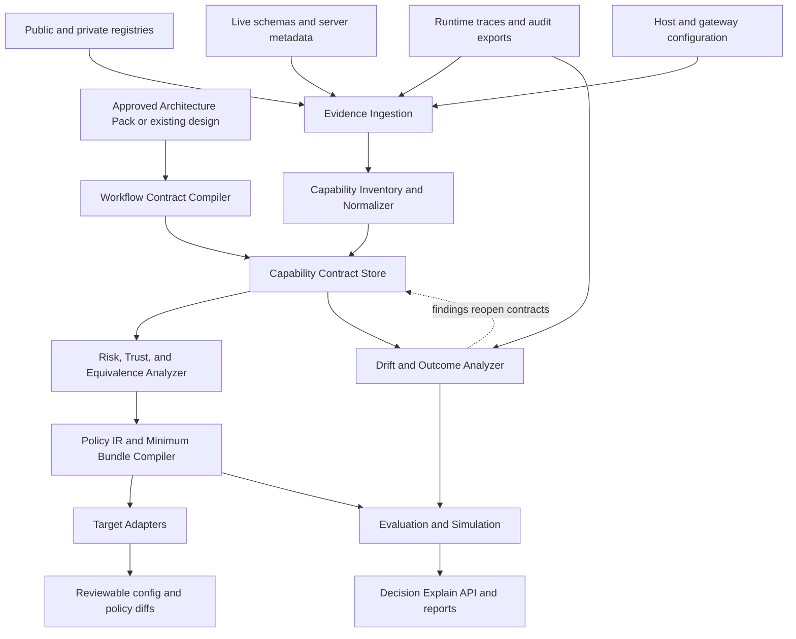
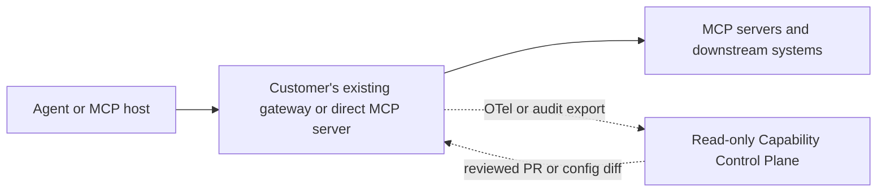

# RFC 0002: Architecture-Driven Capability Control Plane

- **Status:** Accepted design
- **Implementation status:** Not started
- **Decision date:** 2026-07-16
- **Last updated:** 2026-07-16
- **Canonical language:** English
- **Audience:** Maintainers, contributors, design partners, security reviewers, platform teams, and adapter authors
- **Related:** [RFC 0001](./0001-portable-ai-native-architect-skill.md)

## 1. Decision

The project will not begin by building a generic MCP registry, protocol gateway, OAuth broker, or runtime proxy.

It will evaluate and, if validated, build:

> An architecture-driven capability governance compiler and independent assurance layer for agent tools—not another MCP gateway.

The system of record is an organization's **approved Capability Contract Graph**, not a directory of MCP servers. The product translates business architecture decisions into versioned capability contracts, minimum tool bundles, vendor-neutral policy, approval requirements, equivalence proofs, evaluations, drift findings, and target-specific configuration diffs.

The MVP is **out of the runtime data path**. It performs read-only inventory, contract compilation, policy simulation, drift detection, and offline evaluation. Existing hosts, gateways, identity providers, vaults, and execution systems remain responsible for runtime enforcement, credentials, transport, availability, and side effects.

This RFC specifies the product boundary, architecture, contracts, policy intermediate representation, routing semantics, security invariants, protocol strategy, adapters, MVP, validation thresholds, and expansion gates. It does not implement them.

The key words **MUST**, **MUST NOT**, **SHOULD**, **SHOULD NOT**, and **MAY** describe requirements for a conforming implementation.

## 2. Why this decision changed from the initial concept

The initial concept described a unified MCP gateway with registry ingestion, identity, policy, routing, execution, and observability. Deeper research found that cloud platforms, API gateway vendors, developer tooling vendors, and open-source projects already cover substantial parts of that stack.

The durable unsolved problem is different:

- architecture decisions are not expressed as portable capability contracts;
- server and tool metadata are not organizational approval;
- tool schemas and descriptions can drift after review;
- policy semantics differ across hosts and gateways;
- an allowlist does not prove least privilege, semantic equivalence, safe fallback, or workflow outcome;
- teams lack an independent way to test whether their intended architecture survived compilation into each runtime surface.

Therefore, the project will compete above existing data planes and integrate with them. Read-only audit is the MVP wedge; the architecture-to-policy compiler is the intended product boundary.

## 3. Goals

The MVP and core architecture MUST:

1. Convert an approved architecture or equivalent design input into explicit workflow and capability contracts.
2. Normalize business capabilities independently of MCP server and tool names.
3. Separate untrusted source assertions from organization-verified properties.
4. Compile a vendor-neutral policy representation into target-specific configuration or policy diffs.
5. Fail compilation when a target cannot preserve a required semantic; it MUST NOT silently weaken policy.
6. Generate the minimum capability bundle eligible for a user, agent, workflow stage, environment, and purpose.
7. Detect changes to tool identity, description, schema, annotations, authentication, endpoint, and provenance.
8. Simulate allow, deny, approval, revalidation, routing, retry, and fallback decisions.
9. Evaluate tool selection, policy behavior, prompt/tool poisoning, combination risk, and drift response.
10. Explain why a capability is visible, hidden, blocked, or ineligible for fallback.
11. Consume Architecture Decision Packs from RFC 0001 without depending on that Skill.
12. Remain independent of a particular host, gateway, cloud, identity provider, or MCP registry.

## 4. Non-goals

The MVP MUST NOT:

- replace the official public MCP Registry;
- operate a public marketplace;
- host arbitrary MCP servers;
- terminate or proxy runtime MCP traffic;
- own an OAuth authorization server, enterprise IdP, consent UI, token broker, or token vault;
- retain user or service credentials;
- become a generic API gateway;
- own Kubernetes or server lifecycle management;
- become an agent runtime or business workflow orchestrator;
- automatically change enterprise IAM or production gateway configuration;
- make high-risk write calls;
- automatically fall back across providers for payments, email, deletion, permission changes, or production writes;
- use semantic search or an LLM as an authorization decision;
- claim that a single trust score proves safety;
- claim source verification, scanning, or schema validity proves behavior is safe;
- charge for traffic, marketplace transactions, or connector revenue sharing.

## 5. Approaches considered

| Approach | Strengths | Weaknesses | Decision |
|---|---|---|---|
| Full registry + gateway + identity + proxy | Direct enforcement and unified endpoint; familiar enterprise story | Competes with established platforms; assumes token, session, protocol, availability, and high-risk execution liability; large scope before demand proof | Rejected for the initial product |
| Architecture-driven capability and policy overlay | Directly complements Part I; vendor-neutral; does not replace customer data planes; turns decisions into portable, testable contracts | Requires enterprises to maintain contracts; adapter semantics may diverge | **Accepted product direction** |
| Read-only audit and evaluation tool | Lowest operational risk; fastest way to use existing registries, configs, schemas, and traces | Weak as a standalone endpoint; native observability products can absorb it | **Accepted MVP wedge, not the final product** |

## 6. Ownership boundaries

| Concern | System that owns it |
|---|---|
| Business state, workflow transitions, domain decisions, task decomposition, human work queues | Business application or agentic workflow orchestrator |
| Capability contracts, evidence, policy IR, minimum bundles, compilation, simulation, drift, assurance, explanations | This Capability Control Plane |
| Runtime tool visibility and invocation enforcement | Existing host and/or gateway |
| MCP transport, protocol termination, server sessions, retries, rate limits, and availability | Existing host, gateway, and MCP server |
| User/service identity, authentication, token issuance, delegation, revocation | Enterprise IdP and authorization infrastructure |
| Secrets and downstream credentials | Customer vault or platform credential service |
| Public server metadata and namespace information | Official MCP Registry and downstream aggregators |
| Private source catalogs and ownership | Customer private registry, API catalog, or configuration repositories |

The Control Plane may recommend or compile policy, but it MUST represent the observed enforcement strength of each target as `enforced`, `advisory`, `partially_enforced`, or `unsupported`.

## 7. Logical architecture

### 7.1 Design-time and assurance flow



### 7.2 Runtime relationship in the MVP



The MVP does not receive credentials, proxy payloads, or sit on the critical execution path. A future decision sidecar is conditional and described in Section 22.

## 8. Core components

### 8.1 Evidence Ingestion

Ingestion accepts versioned snapshots from:

- an Architecture Decision Pack;
- the official MCP Registry;
- enterprise private registries and API catalogs;
- live MCP capability and tool-schema discovery;
- host and gateway configuration;
- source repositories and lockfiles;
- OpenTelemetry, audit, and evaluation exports.

Every source MUST record provenance, retrieval time, content hash, parser version, and freshness. Official Registry availability MUST NOT be a runtime dependency. Cached public metadata may support discovery, but not authorization or trust claims.

### 8.2 Capability Inventory and Normalizer

The normalizer maps protocol-specific implementations to stable business capability identifiers such as:

```text
communication.email.read
communication.email.send
crm.contact.read
crm.contact.update
engineering.issue.create
data.warehouse.query
finance.payment.initiate
```

Tool names, descriptions, and embeddings may propose a mapping. A human or deterministic organization rule must approve the mapping before it becomes an active contract.

### 8.3 Capability Contract Store

The store is the system of record for organization-approved semantics. Contracts are versioned, signed or digest-bound, reviewable, expiring, and linked to evidence and tests.

One business capability may map to multiple implementations. Multiple implementations MUST NOT enter the same equivalence group unless identity, data boundary, side effects, schema, approval, reversibility, idempotency, and success semantics have been proven equivalent for the declared use.

### 8.4 Workflow Contract Compiler

The compiler converts architecture decisions into stage-specific needs:

- actor and delegated identity;
- purpose and business outcome;
- allowed and prohibited capabilities;
- data classification and residency;
- environment and time constraints;
- approval and validation requirements;
- fallback and retry behavior;
- observability and evaluation requirements.

An Architecture Decision Pack is one input format. Equivalent human-authored or machine-generated specifications are allowed after validation.

### 8.5 Risk, Trust, and Equivalence Analyzer

This component keeps separate:

- source-provided assertions;
- registry provenance;
- static scanner findings;
- organization-verified facts;
- runtime observations;
- unresolved contradictions;
- expired evidence.

It emits an explainable evidence bundle, not an opaque trust score. Any unresolved identity, scope, tenant, write-effect, schema, or equivalence question makes the affected action ineligible.

### 8.6 Policy IR

Policy IR expresses vendor-neutral intent for:

- subject, agent, tenant, and workflow;
- purpose and environment;
- capability eligibility;
- data and region constraints;
- approval and revalidation;
- parameter constraints and redaction;
- routing, retry, and fallback;
- audit and evaluation obligations.

The IR is deterministic and versioned. LLM output MAY propose a draft rule but cannot authorize or activate it.

### 8.7 Minimum Bundle Compiler

For each workflow stage, the compiler creates the smallest eligible capability set. Eligibility is determined before ranking. Semantic retrieval or an LLM MAY rank only within the already eligible set.

The bundle records excluded capabilities and the reason for exclusion. This makes tool reduction auditable rather than a hidden heuristic.

### 8.8 Target Adapters

Adapters compile Policy IR and bundles into reviewable target artifacts for hosts, gateways, and policy engines. An adapter MUST:

1. declare the target product and version;
2. map every supported IR semantic;
3. fail explicitly on unsupported mandatory semantics;
4. label each output's enforcement strength;
5. emit a deterministic diff and test fixture;
6. avoid applying the change automatically in the MVP.

Potential targets include OpenClaw, Docker MCP Gateway, Kong, Azure API Management, GitHub enterprise MCP controls, Google Agent Gateway, AWS AgentCore, OPA/Rego, and Cedar. Inclusion in this list is not a support claim.

### 8.9 Drift and Outcome Analyzer

The analyzer compares approved contracts with new evidence. It detects changes to:

- server identity, owner, origin, endpoint, and version;
- tool name, title, description, parameters, defaults, enums, input schema, and output schema;
- annotations and execution metadata;
- authentication mode, audience, scopes, tenant, and region;
- observed side effects, errors, latency, and outcome behavior;
- target configuration and policy compilation.

A material change quarantines the affected implementation until review and regression evaluation. Description-only drift is material because descriptions can influence discovery and model behavior.

### 8.10 Evaluation and Simulation

The engine evaluates:

- capability mapping and tool selection;
- deterministic eligibility and policy decisions;
- approval binding and replay;
- schema and contract conformance;
- prompt injection and tool poisoning;
- cross-server tool shadowing;
- sensitive-read to external-send combination risk;
- retry, idempotency, and duplicate side effects;
- equivalence and fallback;
- drift detection and quarantine;
- adapter semantic loss.

### 8.11 Decision Explain API

The read-only API answers:

- Why is this capability visible?
- Why was it excluded?
- Which evidence and rule affected the decision?
- What is unsupported on the target?
- Why is fallback forbidden?
- Which contract, schema hash, review, and evaluation apply?

It MUST NOT expose secrets or raw sensitive payloads.

## 9. Capability Contract

The following illustrates the required semantic areas; the implementation schema will be versioned separately.

```yaml
apiVersion: capability.ai-native.dev/v1alpha1
kind: CapabilityContract
metadata:
  id: communication.email.send
  version: 1.2.0
  owner: collaboration-platform
  status: approved
  reviewedAt: 2026-07-16T00:00:00Z
  expiresAt: 2026-10-16T00:00:00Z

implementation:
  serverRef: com.vendor/email@3.4.1
  toolName: send_email
  endpointClass: corp-primary
  protocolVersions: ["2025-11-25"]
  inputSchemaHash: sha256:...
  outputSchemaHash: sha256:...
  sourceProvenance: registry+live-introspection
  sourceAnnotations: {}
  verifiedProperties: {}

semantics:
  actionClass: external_write
  destructive: false
  reversible: false
  idempotency: conditional
  idempotencyKeyField: request_id
  readsPrivateData: true
  seesUntrustedContent: true
  canExternalizeData: true
  dataClasses: [pii, confidential]
  successPredicate: recipient accepted the intended message exactly once

identity:
  principalTypes: [human_delegated]
  delegationMode: oauth_authorization_code
  requiredScopes: [mail.send]
  audience: https://mcp.example.com
  tenantBinding: required
  credentialPassthrough: forbidden

policy:
  environments: [staging, production]
  riskTier: high
  allowedAgents: [customer-support-assistant]
  approval:
    required: true
    binds: [user, capability, normalized_argument_hash, implementation, expiry]
  redactionProfile: outbound-email

routing:
  equivalenceGroup: null
  fallback: forbidden
  retry:
    transientOnly: true
    maxAttempts: 0

assurance:
  evidenceRefs: []
  testVectors: []
  evalSuite: email-send-v3
  reviewer: security-platform
```

Source annotations are untrusted server assertions. They MUST NOT be copied into `verifiedProperties` without evidence and review.

## 10. Workflow Contract

```yaml
apiVersion: capability.ai-native.dev/v1alpha1
kind: WorkflowContract
metadata:
  workflowId: support-case-resolution
  stageId: draft-customer-response
  owner: customer-support

intent:
  actor: support-agent
  purpose: resolve an authenticated customer case
  outcome: an accurate response approved when policy requires

capabilities:
  allowed:
    - customer.case.read
    - knowledge.search
    - communication.email.draft
  prohibited:
    - communication.email.send
    - customer.refund.execute

constraints:
  environment: production
  dataClasses: [customer-pii]
  region: eu
  freshness: PT15M
  approval: none
  fallback: verified_read_only_equivalence_only

assurance:
  auditLevel: decision_and_summary
  evalSuites: [support-read-boundary-v2]
  failureMode: deny_and_escalate
```

The business orchestrator selects the workflow stage. The Control Plane does not infer or advance the business state.

## 11. Policy IR and decision semantics

### 11.1 Rule shape

```yaml
apiVersion: policy.ai-native.dev/v1alpha1
kind: CapabilityPolicy
metadata:
  id: support-draft-read-boundary
  version: 1.0.0

match:
  subjects: [support-agent]
  agents: [customer-support-assistant]
  workflows: [support-case-resolution/draft-customer-response]
  environments: [production]

effect: allow
capabilities:
  include: [customer.case.read, knowledge.search, communication.email.draft]
  exclude: [communication.email.send, customer.refund.execute]

constraints:
  tenantBinding: required
  dataClasses: [customer-pii]
  region: eu
  schemaStatus: approved_only
  evidenceStatus: current_only

obligations:
  audit: decision_and_summary
  evaluation: support-read-boundary-v2
```

### 11.2 Decision values

Simulation and any future policy decision point return exactly one of:

```text
allow
deny
require_approval
require_revalidation
indeterminate
```

`indeterminate` is fail-closed. It is not an invitation for the model to choose.

The MVP only simulates decisions and compares them with target configuration. It does not enforce runtime calls.

## 12. Minimum Capability Bundle

Each bundle binds:

- subject, agent, tenant, workflow, stage, purpose, environment, and expiry;
- included capability contracts and exact implementation/schema hashes;
- excluded candidates and reasons;
- required approvals and evidence freshness;
- adapter target and enforcement strength;
- estimated tool/schema exposure where available;
- policy and evaluation versions.

Bundles are signed or digest-bound artifacts. They are not credentials and MUST NOT contain tokens.

## 13. Routing, retry, and fallback

### 13.1 Discovery routing

The bundle compiler filters the catalog to the minimum eligible set. This is the primary routing function in the MVP.

### 13.2 Policy routing

Identity, tenant, environment, region, data class, purpose, approval, contract status, and evidence freshness are deterministic eligibility filters. A model or vector search MUST NOT override them.

### 13.3 Endpoint routing

An existing gateway MAY choose among replicas or regions of the same approved implementation when identity, tenant, data residency, schema, side effects, and policy remain equivalent. The Control Plane may compile eligibility and tests; it does not perform the runtime route in the MVP.

### 13.4 Compatibility routing

Fallback is allowed only within a reviewed, versioned equivalence group.

Automatic fallback is normally eligible only when:

- implementations provide the same business capability and success predicate;
- input and output semantics are compatible;
- identity, account, tenant, scopes, region, and data boundary are equivalent;
- side effects are read-only or demonstrably idempotent;
- approval remains bound to the same reviewed action;
- all implementations have current evidence and passing evaluations.

Automatic fallback is forbidden by default for:

- email or message sending;
- payments or financial commitments;
- deletion, archival with destructive semantics, or permission changes;
- production writes;
- legal, regulated, safety-critical, irreversible, or non-idempotent actions;
- any change of tenant, user account, token audience, or approval object.

### 13.5 Workflow routing

Business workflow routing belongs to the business orchestrator. The Control Plane supplies an eligible capability bundle and constraints for a known stage; it does not design or execute the stage graph at runtime.

### 13.6 Retry

- Retry is limited to classified transient failures.
- A business or tool-execution error is not automatically retryable.
- A write may retry only when the idempotency contract, key propagation, implementation behavior, and target adapter are verified.
- Cross-provider retry is fallback and follows all equivalence rules.
- A retry or fallback that changes normalized arguments, implementation class, identity, tenant, or audience invalidates the prior approval.

## 14. MCP protocol strategy

As of 2026-07-16:

- MCP `2025-11-25` is the normative current specification baseline and is ready for use;
- `2026-07-28` is a locked release candidate and compatibility target, not yet the normative final baseline.

The product MUST store protocol version per implementation and negotiate or validate version compatibility. Core abstractions MUST NOT depend on session affinity, initialization-time-only metadata, or a long-lived connection. This preserves compatibility with the candidate move toward stateless discovery and request-level metadata.

MCP protocol capabilities and business capabilities are separate concepts. A protocol tool becomes an approved business capability only through mapping, evidence, review, policy, and evaluation.

The official Registry is a preview public metadata source. It is not a private enterprise catalog, runtime authority, uptime dependency, or code-safety certification. The product SHOULD ingest snapshots through an aggregator-compatible interface and retain source provenance.

## 15. Identity and authorization invariants

If a target or future component handles HTTP authorization, it MUST preserve the MCP authorization requirements and these invariants:

1. OAuth 2.1, protected resource metadata, resource indicators, PKCE, and exact redirect/state handling are required where applicable.
2. The MCP server or enforcing gateway validates token audience.
3. Inbound client tokens MUST NOT be passed through as downstream API tokens.
4. Downstream credentials are separately issued, exchanged, or injected with minimum scope.
5. User, agent/workload, service, tenant, workflow, approval, and target audience remain distinguishable in evidence.
6. Session identifiers are not authentication or identity.
7. Per-client consent is required when an authorization proxy shares a static upstream client identity.
8. Tokens are short-lived, revocable, vault-stored, and absent from model context, contracts, bundles, logs, and ordinary errors.
9. A fallback that changes audience, tenant, account, or delegated identity requires new authorization and approval.
10. OAuth discovery and redirects validate scheme, host, DNS/IP, every redirect hop, and private/link-local/metadata destinations to prevent SSRF.

The MVP reads sanitized configuration and evidence. It does not handle tokens.

## 16. Tool and schema trust invariants

1. Namespace or publisher verification proves control of an identity; it does not prove safe code or behavior.
2. MCP annotations such as read-only, destructive, idempotent, and open-world are untrusted hints.
3. The approved contract hash covers server identity, tool name/title/description, input and output schemas, annotations, auth metadata, endpoint class, and execution metadata.
4. A tool-list change notification, reconnect, version change, or hash mismatch triggers re-ingestion and quarantine.
5. Schema syntax validity does not prove semantic validity. Tests must verify business invariants such as “archive does not delete.”
6. Tool descriptions, results, resources, links, logs, and error messages are untrusted content.
7. A sensitive-read capability combined with encode, upload, search, email, or message capabilities creates a composition risk that must be evaluated at bundle and workflow level.
8. A malicious server cannot authorize or alter the arguments of another server.
9. High-risk approval binds user, capability, normalized argument hash, implementation or equivalence group, schema hash, tenant, purpose, and expiry.

## 17. Tenant, data, and audit invariants

- Tokens, caches, queues, approvals, contracts, traces, and object identifiers MUST be tenant-isolated.
- Data residency and classification are eligibility constraints, not descriptive tags.
- Logs contain redacted summaries by default. Full payloads, if a design partner explicitly provides them, use separate high-privilege, short-retention evidence storage.
- The evidence chain MUST reconstruct requester, user intent, agent/workload, tenant, workflow stage, visible bundle, policy decision, approval, implementation, schema hash, target configuration, invocation summary, and outcome where available.
- Missing trace fields reduce assurance. The product MUST NOT infer an auditable or successful outcome from a call count.
- Telemetry export is opt-in. Open-source local use MUST work without sending project data to a hosted service.

## 18. Failure behavior

| Failure | Required behavior |
|---|---|
| Official Registry unavailable | Use a versioned cache for discovery only; record staleness; do not make trust or authorization claims |
| Live schema unavailable | Preserve last observation as stale; make new or changed implementation ineligible |
| Schema, description, auth, endpoint, or provenance drift | Quarantine the implementation; identify affected contracts, bundles, policies, and evaluations |
| Identity, tenant, audience, scope, or data boundary unknown | `indeterminate`, therefore deny in simulation and flag for review |
| Target cannot enforce a mandatory rule | Fail compilation; emit `unsupported`; do not approximate silently |
| Target only provides an advisory allowlist | Emit the artifact as `advisory`; do not claim runtime enforcement |
| Approval evidence missing or stale | `require_approval` or `require_revalidation`; never infer approval |
| Trace is incomplete or redaction removes required evidence | Lower assurance and report the exact verification gap |
| Evaluation contains a critical false permit | Block the affected release or adapter |
| Contract evidence expires | Quarantine until renewed or explicitly deprecated |
| Sensitive data or credential appears in ingestion | Stop ingestion, avoid persistence, and require incident handling or rotation |

## 19. MVP

### 19.1 Validation question

> Will an organization maintain a gateway-independent capability contract and use it to detect policy drift, reduce tool exposure, and test high-risk routing decisions across more than one agent or governance surface?

### 19.2 Scope

The reference MVP includes:

- one organization and tenant boundary;
- two host or governance surfaces;
- three to five remote MCP servers;
- ten to thirty normalized capabilities;
- primarily read-only capabilities;
- official Registry snapshot plus a private inventory and live schema snapshot;
- imported host/gateway configuration;
- imported sanitized OTel or JSON audit traces;
- capability and workflow contracts;
- deterministic Policy IR;
- minimum bundle compilation;
- schema, description, auth, and endpoint drift detection;
- policy and adapter simulation;
- tool-selection and poisoning evaluations;
- reviewable configuration or policy diffs;
- one high-risk write capability modeled only in offline approval, retry, and fallback simulation.

The first adapter is OpenClaw. The default second reference adapter is Docker MCP Gateway because it is open-source and exercises a distinct gateway surface. If the first design partner already operates a different gateway, that gateway may replace Docker only if it provides a version-pinned test environment and maintains the same adapter conformance suite.

The OpenClaw adapter MUST distinguish configuration and conformance checks from runtime enforcement; documentation or policy drift checks alone cannot be labeled `enforced`.

### 19.3 Outputs

```text
control-plane-assessment/
├── source-inventory.yaml
├── capability-contracts/
├── workflow-contracts/
├── policy-ir/
├── bundles/
├── target-diffs/
├── drift-report.md
├── evaluation-report.md
├── assurance-gaps.md
└── evidence-manifest.yaml
```

All target changes are proposed through a diff or pull request and require human review. The MVP does not apply them.

### 19.4 Explicit exclusions

The MVP excludes runtime proxying, token handling, public marketplace features, local stdio server hosting, enterprise IdP integration, automatic IAM changes, automated high-risk writes, billing, a general workflow engine, and opaque AI safety scoring.

## 20. Evaluation and acceptance

### 20.1 Protocol and contract tests

- MCP `2025-11-25` metadata and schema ingestion;
- version negotiation or graceful incompatibility;
- incomplete, additional, malformed, oversized, and conflicting schema fields;
- deterministic contract serialization and hashing;
- adapter round-trip and unsupported-semantic failure;
- permission and data-boundary cases;
- approval binding and replay;
- retry and idempotency;
- drift and quarantine.

### 20.2 Security tests

- missing PKCE or state validation in imported auth design;
- audience mismatch and token passthrough configuration;
- malicious metadata URLs and redirects;
- cross-tenant identifiers and evidence;
- tool description/schema poisoning;
- result and error-message injection;
- server shadowing and rug pull;
- sensitive-read plus external-send composition;
- unauthorized destructive action;
- stale evidence and approval;
- fallback across identity, tenant, account, region, or side-effect boundary.

Unauthorized high-risk action, secret exposure, cross-tenant access, token passthrough, and undetected material drift have a required threshold of zero.

### 20.3 Product thresholds

Before expanding beyond MVP:

- at least three of twelve target organizations report both multiple agent/host surfaces and a cross-team capability-governance problem;
- at least two organizations provide real private schemas/configuration/traces within sixty days;
- read-only assessment reduces manual inventory or audit effort by at least 30%, or finds a material unknown policy/drift gap;
- minimum bundles reduce exposed tools or schema-token volume by at least 40% without degrading selection accuracy;
- ordinary allow/deny conformance is at least 95%; critical/destructive false permits remain zero;
- material drift is deterministically associated with affected contracts within fifteen minutes of ingestion;
- two of three design partners choose to continue into a paid or committed pilot.

## 21. Falsification conditions

The product direction must stop, narrow, or change if:

- target organizations can solve the problem entirely within one existing platform and do not value cross-platform assurance;
- customers want only a runtime gateway and will not maintain capability contracts;
- no accountable contract owner or reviewer exists in customer organizations;
- the compiler must silently weaken rules on target platforms;
- critical or destructive policy tests produce any false permit;
- capability modeling routinely takes more than two hours per capability or recurring maintenance exceeds its value;
- two adapters repeatedly require incompatible core IR semantics;
- schema and configuration drift cannot be linked to affected policies and evaluations;
- minimum bundles do not reduce exposure or improve selection;
- fallback simulation produces duplicate effects or crosses tenant/account boundaries;
- available traces cannot establish workflow outcomes or meaningful assurance;
- MCP protocol evolution forces the core model to depend on one transport or session design;
- design partners are unwilling to share sanitized schemas, configuration, or evidence.

## 22. Conditional runtime expansion

A runtime policy decision sidecar or plugin MAY be proposed in a future RFC only when:

1. at least two design partners need enforcement not provided by their existing host or gateway;
2. the read-only compiler and evaluation product has passed the thresholds in Section 20;
3. the Policy IR is stable across at least two independent targets;
4. critical false permits remain zero in the declared suite;
5. identity, authorization, tenancy, availability, audit, rollback, and incident ownership have independent security review;
6. the component can be added without becoming a generic protocol proxy or token vault.

Runtime expansion is not an automatic next phase. It requires separate product evidence and design approval.

## 23. Open-source boundary

The open-source project SHOULD publish:

- capability and workflow contract schemas;
- Policy IR;
- deterministic validators and hash rules;
- sample adapters and conformance fixtures;
- evaluation cases and sanitized reference data;
- drift and assurance report formats;
- compatibility and enforcement-strength evidence.

Hosted or enterprise products MAY later add collaborative review, private ingestion, policy inventory, managed evaluation, and organization integrations. The open schemas and local compiler MUST remain useful without a hosted account.

## 24. Relationship to RFC 0001

```text
Part I: architecture intent and candidate contracts
  -> Part II: independently verified capability contracts and compiled policy
  -> existing host/gateway: runtime enforcement and execution
  -> trace and outcome evidence
  -> Part II: drift and evaluation
  -> Part I: architecture decision reopened when evidence invalidates an assumption
```

Rules:

- Part I output is a candidate input, not authorization.
- Part II accepts inputs not produced by Part I.
- Part I operates without Part II.
- Part II does not become the business orchestrator.
- Runtime evidence can supersede an architecture assumption only through a reviewable decision.

## 25. Consequences

### Positive

- The project avoids direct competition with mature registry and gateway infrastructure.
- The MVP avoids credentials, payload proxying, and runtime availability liability.
- A portable contract can reveal where vendor configuration weakens architecture intent.
- The product can integrate with OpenClaw and other agentic workflows without owning them.
- Drift and evaluation become first-class evidence rather than an afterthought.

### Costs

- Customers must assign owners and review capability contracts.
- Adapter maintenance follows vendor releases.
- Read-only analysis may have lower immediate willingness to pay than runtime enforcement.
- Limited or redacted traces can cap assurance.
- Explicit compilation failure may expose that some targets cannot implement the intended policy.

## 26. Implementation sequence

This is a design sequence, not an implementation plan:

1. Define versioned capability, workflow, evidence, bundle, and Policy IR schemas.
2. Build deterministic validation, hashing, and unsupported-semantic behavior.
3. Ingest static registry, private inventory, schema, and configuration snapshots.
4. Compile minimum bundles and policy simulations.
5. Add drift and evaluation reports.
6. Implement the OpenClaw adapter and one second reference adapter.
7. Run a design-partner assessment with sanitized evidence.
8. Evaluate market and technical falsification thresholds before proposing runtime enforcement.

A task-level implementation plan requires a separate written-plan phase after this RFC is reviewed.

## 27. References

### MCP specification and project guidance

- [MCP versioning](https://modelcontextprotocol.io/docs/learn/versioning), accessed 2026-07-16.
- [MCP specification 2025-11-25](https://modelcontextprotocol.io/specification/2025-11-25/basic), 2025-11-25.
- [MCP authorization](https://modelcontextprotocol.io/specification/2025-11-25/basic/authorization), 2025-11-25.
- [MCP security best practices](https://modelcontextprotocol.io/docs/tutorials/security/security_best_practices), accessed 2026-07-16.
- [Official MCP Registry: About](https://modelcontextprotocol.io/registry/about), accessed 2026-07-16.
- [MCP Registry aggregators](https://modelcontextprotocol.io/registry/registry-aggregators), accessed 2026-07-16.
- [MCP 2026 roadmap](https://blog.modelcontextprotocol.io/posts/2026-mcp-roadmap/), 2026-03-09.
- [MCP 2026-07-28 release candidate](https://blog.modelcontextprotocol.io/posts/2026-07-28-release-candidate/), 2026-05-21.

### Representative existing control and gateway surfaces

- [Microsoft MCP Gateway](https://microsoft.github.io/mcp-gateway/), accessed 2026-07-16.
- [Azure API Management MCP overview](https://learn.microsoft.com/en-us/azure/api-management/mcp-server-overview), accessed 2026-07-16.
- [Google Agent Registry: manage MCP tools](https://docs.cloud.google.com/agent-registry/manage-mcp-tools), accessed 2026-07-16.
- [GitHub enterprise MCP registry and access](https://docs.github.com/en/copilot/how-tos/administer-copilot/manage-mcp-usage/configure-mcp-server-access), accessed 2026-07-16.
- [Docker MCP Gateway](https://docs.docker.com/ai/mcp-catalog-and-toolkit/mcp-gateway/), accessed 2026-07-16.
- [Kong MCP Gateway](https://developer.konghq.com/mcp/), accessed 2026-07-16.
- [OpenClaw policy CLI](https://docs.openclaw.ai/cli/policy), accessed 2026-07-16.
